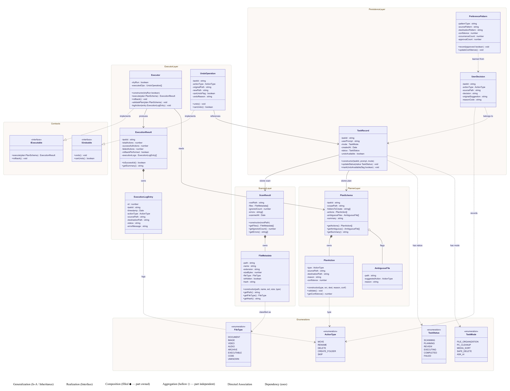

# Sentinel — Class Diagram

This document provides a class diagram illustrating the Object-Oriented design and structure of the Sentinel application.

---

## 📊 Diagram

---

## 🗂️ Overview

The class diagram outlines the core components and their relationships within Sentinel, including:

-   **Interface Layer**: Classes responsible for user interactions (CLI, Web, Desktop).
-   **Core Agent**: The central classes managing the file scanning, classification, AI planning, and execution operations.
-   **Data Models**: The structural representation of data entities handling logs, preferences, and tasks.

*The above diagram provides a visual high-level overview of the OOP structure.*
