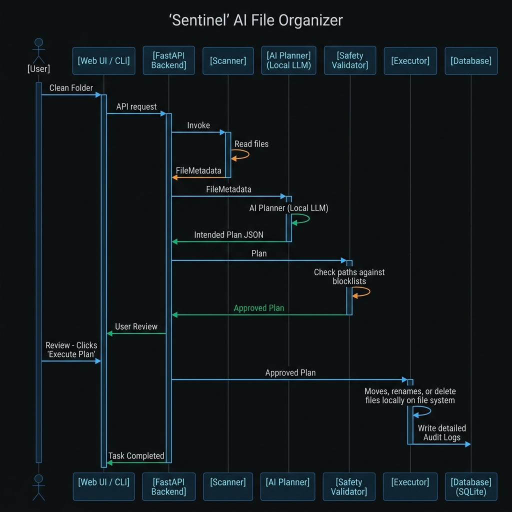
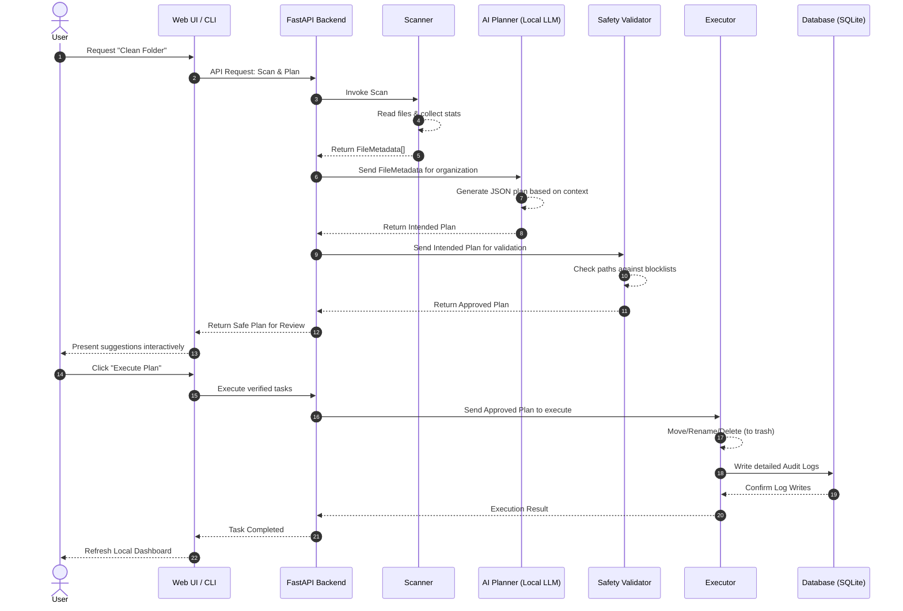

# Sentinel — Execution Sequence Diagram

## 🔗 Interactive Mermaid Source

```mermaid
sequenceDiagram
    autonumber
    actor User
    participant WebUI as Web UI / CLI
    participant API as FastAPI Backend
    participant Scanner
    participant AI as AI Planner (Local LLM)
    participant Safety as Safety Validator
    participant Executor
    participant DB as Database (SQLite)

    User->>WebUI: Request "Clean Folder"
    WebUI->>API: API Request: Scan & Plan
    API->>Scanner: Invoke Scan
    Scanner-->>Scanner: Read files & collect stats
    Scanner-->>API: Return FileMetadata[]
    API->>AI: Send FileMetadata for organization
    AI-->>AI: Generate JSON plan based on context
    AI-->>API: Return Intended Plan
    API->>Safety: Send Intended Plan for validation
    Safety-->>Safety: Check paths against blocklists
    Safety-->>API: Return Approved Plan
    API-->>WebUI: Return Safe Plan for Review
    WebUI-->>User: Present suggestions interactively
    User->>WebUI: Click "Execute Plan"
    WebUI->>API: Execute verified tasks
    API->>Executor: Send Approved Plan to execute
    Executor-->>Executor: Move/Rename/Delete (to trash)
    Executor->>DB: Write detailed Audit Logs
    DB-->>Executor: Confirm Log Writes
    Executor-->>API: Execution Result
    API-->>WebUI: Task Completed
    WebUI-->>User: Refresh Local Dashboard
```
